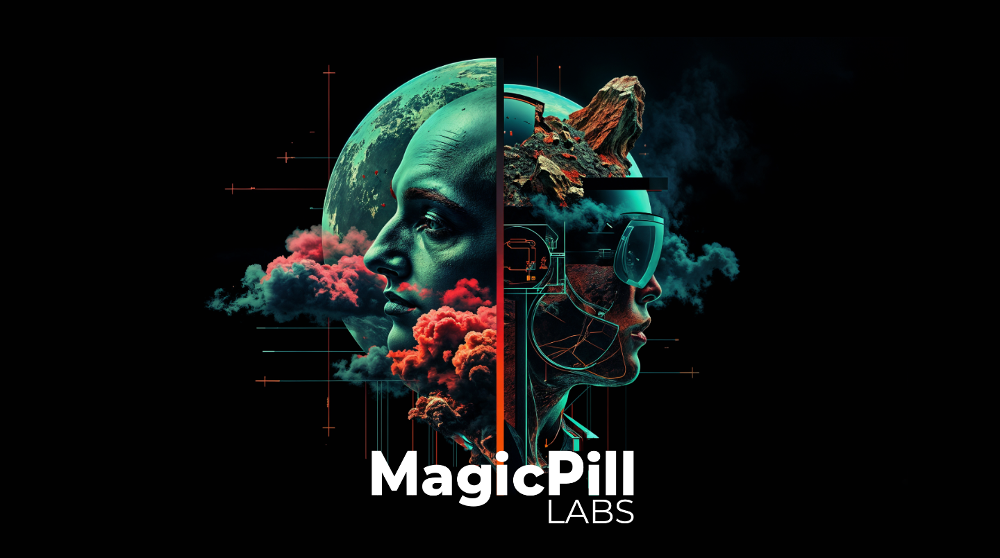

    
     
     
     
    <i>
    Magical Solutions for Mortal Problems   
    </i>
     

 

MagicPill Labs is a technology research and development organization focused on using AI to build applications and solutions that address real world use cases and problems. I started this project unofficially in 2023, with the goal of exploring how AI could be used to generate datasets from synthetic and realworld data. Overtime through developing my own tools and talking with my enterprise community, MagicPill Labs has shifted towards developing tools and research to increase insights on AI systems. 

With increasingly more AI tools and applications being developed, there is an ever-growing need for software systems (agentic, automated, human or hybrid focused) to help devs and application builders keep their AI applications and systems healthy.

_~Robby Boney, Feb 2024_

 

# Key Focuses

- AI System Profiling
- AI Evaluation and Testing
- AI Performance Monitoring

